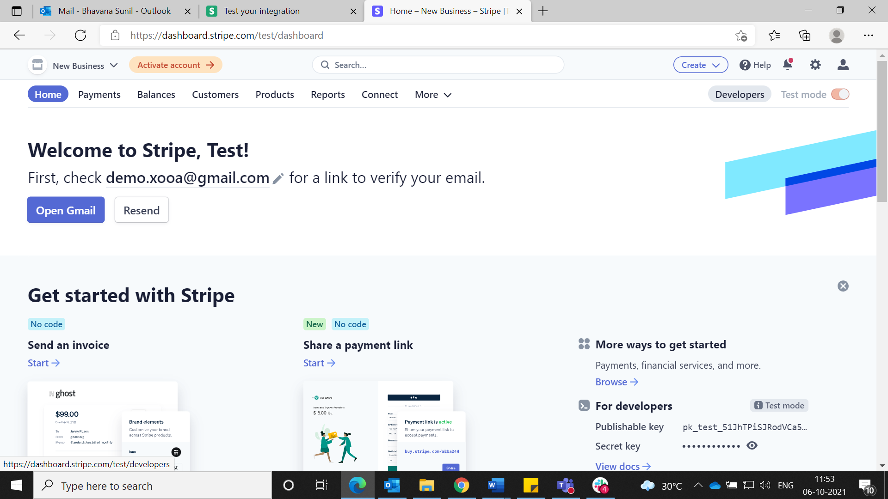
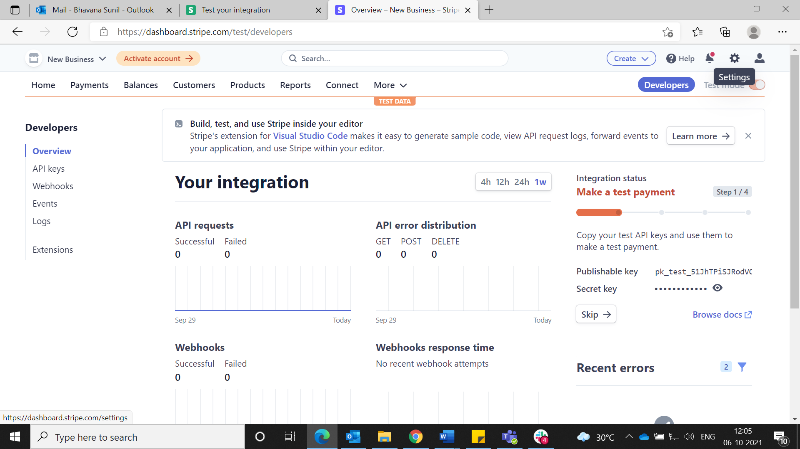
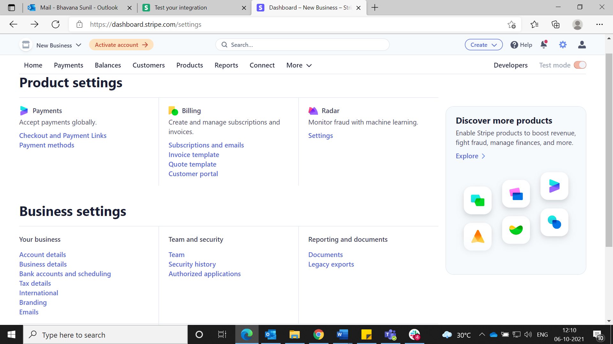
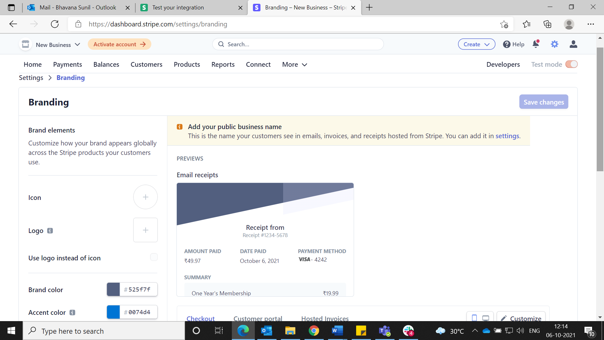
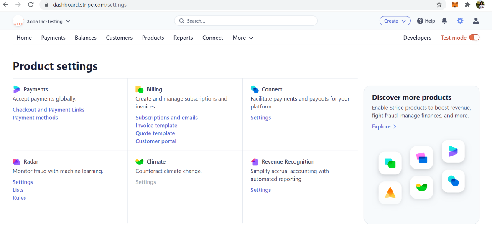
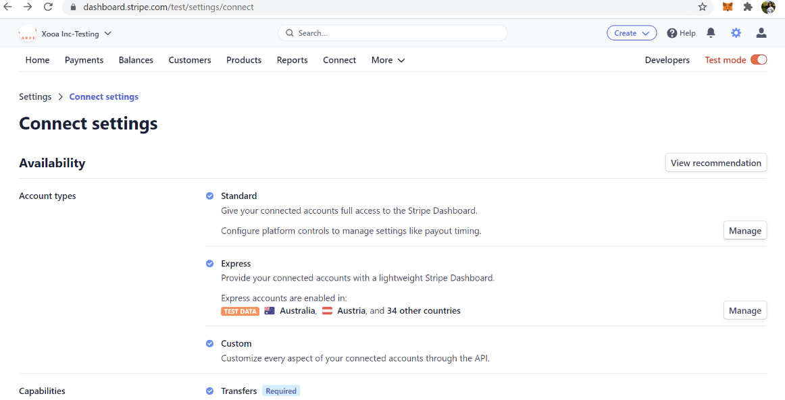
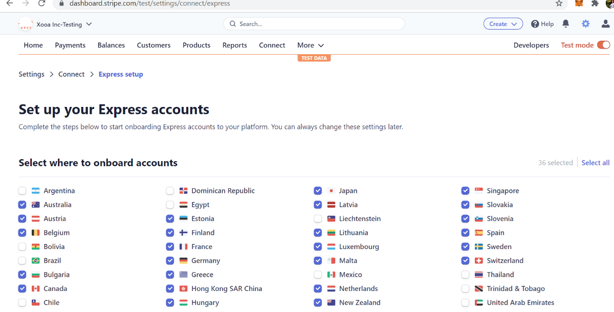
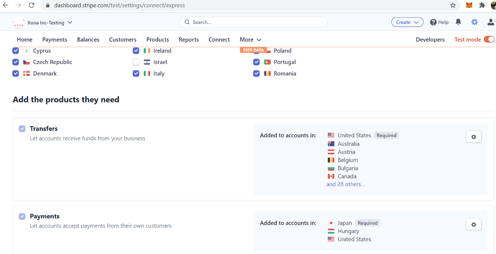

# Table of Contents

[1 Introduction 4](#introduction)

[1.1 Prerequisites 4](#prerequisites)

[2 How to configure payment settings using Stripe
4](#how-to-configure-payment-settings-using-stripe)

# Introduction

Stripe is an online payment processing and credit card processing
platform for businesses. We use Stripe as our payment processor. Minimum
API version required is 2020-03-02.

To accept payments for your White Label NFT marketplace and integrate
with Xooa, follow the steps given below.

## Prerequisites

User must have deployed the Xooa app.

# How to configure payment settings using Stripe 

**Step 1:** Sign up on <https://stripe.com>

**Step 2:** To test your app, switch between test and live mode

**Step 3:** Go to **Home**In the Get started with Stripe section, hover
over the publishable key to copy the link and click view button to view
and copy the secret key.

Alternatively, you can find the keys in **Home**click **Developers**
button on the right-hand sideclick **API Keys** in the navigation menu
on the leftview **Publishable Key** and **Secret Key.** Switch between
test mode and live stripe mode to view test/live keys.

**Step 4:** To configure **Branding**:

1.  Click **Settings** at the top right corner

2.  Under **Business Settings** sectionclick **Branding**

3.  Complete branding settings for your marketplace and **Save changes**

4.  To complete express settings, select the countries you want your
    marketplace to deal with. Go to **Settings** from the home pageunder
    the **Connect** sectionclick **Settings**

5.  Account Typesclick **Manage**

6.  Select the countries from the list

7.  Add the products to each country as per requirement and **Save
    changes**.

The Stipe account is now set for transactions. Users can switch between
test/live mode to get the publishable and secret keys and settings.
